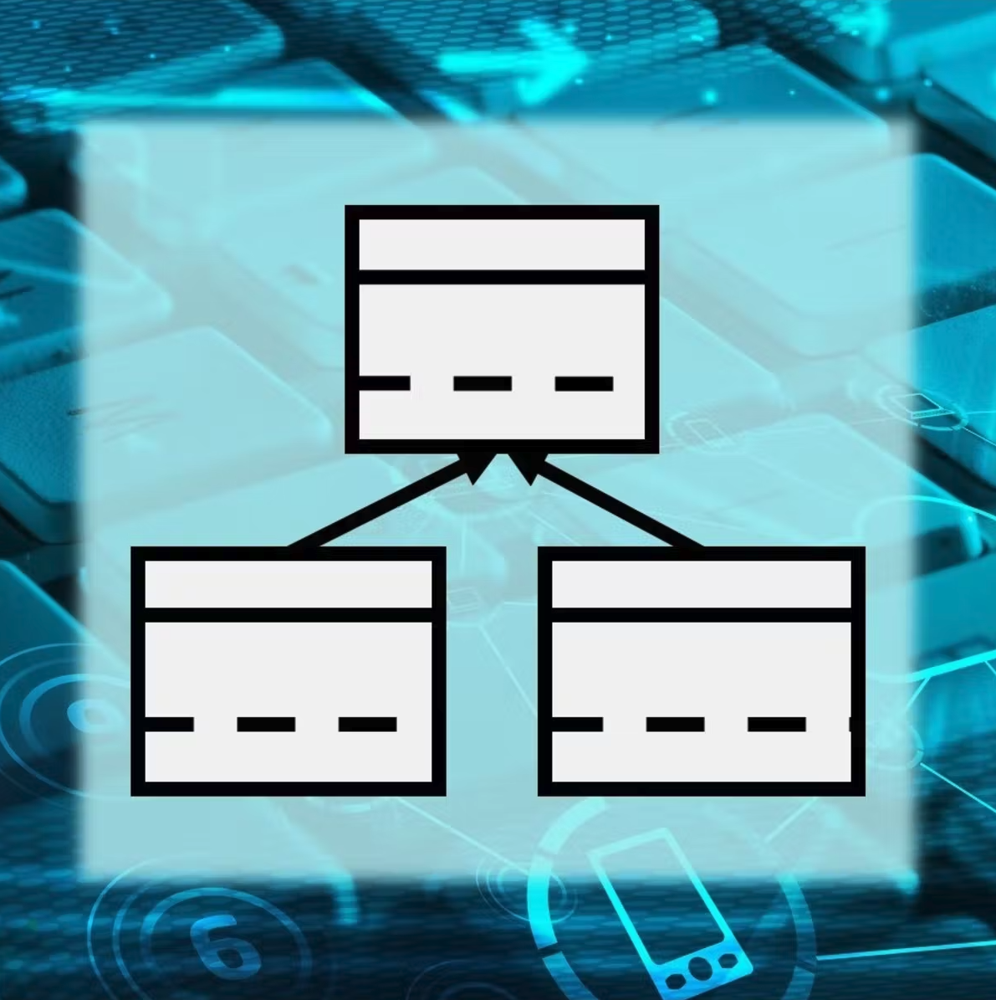

 

  

**Instructors:** [Hia Ghosh](TODO) and [Ab Mosca](https://amosca01.github.io/aemosca/)

**Course Meets:** TTh 9:25-10:40AM EST (Section 01) / 10:50AM-12:05PM EST (Section 02)

**Location:** Bass 204

**Hia's Office Hours:** Wednesdays 09:00-11:00 ET

**Ab's Office Hours:** Mondays 09:45-11:15 EST, Fridays 11:00-12:30 EST in Bass 105/107

**TA Hours**: Sundays 1-3PM EST, Sundays through Wednesdays 7-9PM EST in Ford Hall

## Course Description:
This course emphasizes computational problem-solving using a typed object-oriented programming (OOP). Students will learn core computer science principles including: control flow, functions, classes, objects, methods, encapsulation and information-hiding, specification, recursion, debugging, unit testing, version control, using libraries and writing code in multiple files. Abstract data types and simple data structures will be used to illustrate concepts of OOP and solve computational problems through regular programming assignments (in Java and Python). 

This course assumes prior programming experience including a basic understanding of branching (if-statements), iteration (loops), functions and simple data types (integers, strings, lists/arrays). _Prerequisites: CSC 110 or equivalent. Cannot be taken concurrently with CSC 110._

## Learning Goals:
Upon successful completion of this course, students will be able to:

 - Use object-oriented techniques to write programs.
 - Develop classes and interfaces with overloaded methods. 
 - Use inheritance, polymorphism, and abstract classes.
 - Design and implement robust, reusable, human-friendly programs (including the development of unit tests and custom exception classes).
